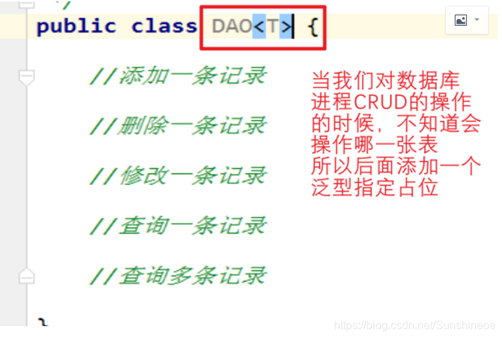
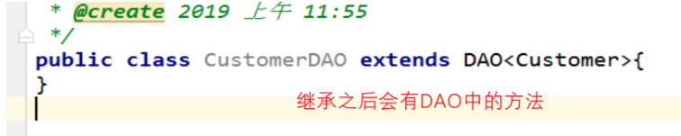

# 泛型
## 为什么要使用泛型？
### 泛型俗称“标签”，使用<E>表示。泛型就是在允许定义类，接口时通过一个标识表示某个属性的类型或者是某个方法的返回值或者是参数类型，参数类型在具体使用的时候确定，在使用之前对类型进行检查。
### 泛型意味着编写的代码可以被很多不同类型的对象重用。例如集合ArrayList，如果集合不添加泛型，里面可以存储任何类型也就是Object，当添加泛型的时候，提高了代码的重用。
### 泛型提供了类型参数，比如ArrayList类有一个类型参数来指示元素的类型，使得代码具有更好的可读性，一看就知道数组列表中包含的是String对象。
````
ArrayList<String> list = new ArrayList<String>();

ArrayList<String> list = new ArrayList<>();
````
### 当代码进行编译的时候，编译器知道ArrayList<String>添加元素的类型是String类型。当编译的时候，编译器可以对调剂的元素进行检查，避免错误类型的对象，出现和集合中的泛型不匹配的对象是无法通过编译。泛型的好处在于使得程序具有更多的可读性和安全性。

### 补充：在Java库中，使用变量E表示集合的元素类型，K和V分别表示关键字和值的类型。T表示任意类型。

### 总结：泛型类可以看成普通类的工厂。需要什么类型的，泛型类就会类的后面添加什么类型的属性和方法。

## 编译
### 虚拟机中没有泛型，只有普通的类和方法
### 所有的类型参数都用他们的限定类型进行替换
### 为了保持类型的安全性，必要时插入强制类型转换

## 上界通配符：

### 上届：用 extends 关键字声明，表示参数化的类型可能是所指定的类型，或者是此类型的子类。

### 在类型参数中使用 extends 表示这个泛型中的参数必须是 E 或者 E 的子类，这样有两个好处：

#### 如果传入的类型不是 E 或者 E 的子类，编译不成功
#### 泛型中可以使用 E 的方法，要不然还得强转成 E 才能使用
#### 类型参数中如果有多个类型的参数，用逗号分开。
````
Pair<? extends Employee>
private <K extends A, E extends B> E test(K arg1, E arg2){
E result = arg2;
arg2.compareTo(arg1);
//.....
return result;
}
````
## 下界通配符：
### 用 super 进行声明，表示参数化的类型可能是所指定的类型，或者是此类型的父类型，直至 Object。
````
private <T> void test(List<? super T> dst, List<T> src){
for (T t : src) {
dst.add(t);
}
}

public static void main(String[] args) {
List<Dog> dogs = new ArrayList<>();
List<Animal> animals = new ArrayList<>();
new Test3().test(animals,dogs);
}
````
上界通配符主要用于读数据，下界通配符主要用于写数据。

## ？和 T 的区别

### T：指定集合元素只能是T类型
````
List<T> list = new ArrayList<T>();
````
### ？：集合元素可以是任意类型，没有任何意义，就是个占位符，一般方法中，只是为了说明用法
````
List<?> list = new ArrayList<?>();
````
### ？和 T 都表示不确定的类型，区别在于我们可以对 T 进行操作，但是对 ？不行，比如如下这种 ：
````
T t = operate();

// 不可以
？car = operate();
````
## 反射和泛型，Class<T>
### 反射允许你在运行时分析任何对象。Class<T>在实例化的时候，T 要替换成具体类。Class<?>它是个通配泛型，? 可以代表任何类型，所以主要用于声明时的限制情况。
### 应用，举例：
### 比如我们常用的数据访问对象DAO层，当我们对数据库表进行操作的时候，不知道是哪一张表的操作，所以可以定义一个泛型类来实现

### 然后再定义一个方法继承DAO,比如以下的继承，类CustomerDAO可以直接使用DAO<Customer>，对应的是数据库中的Customer的表

## 泛型之间的继承关系
### 泛型在继承方面的体现，类A是类B的父类，G<A> 和G<B>二者不具备子父类的关系，二者是并列的关系
````
List<Object> list1 = null;
List<Integer> list2 = null;

// 二者不具备子父类关系，二者的关系是并列的
list1 = list2;
````

原文链接：https://blog.csdn.net/Sunshineoe/article/details/110162807